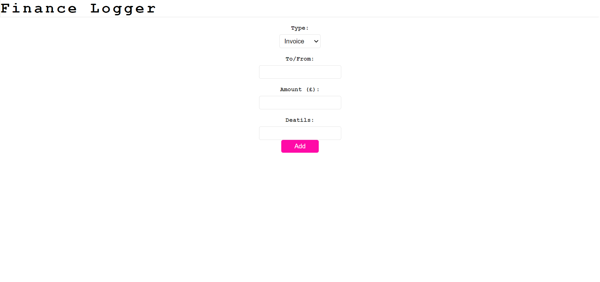
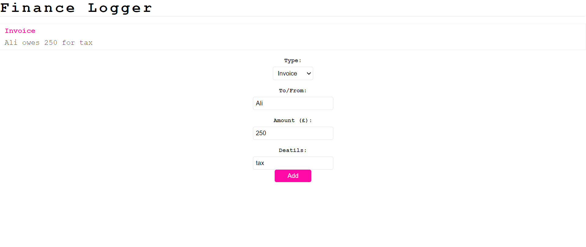

# Finance-Logger

## Table of Contents 

* [Description](#description)
* [User Story](#description)
* [Acceptance Criteria](#acceptance-criteria)
* [Usage](#usage)
* [Screenshot](#screenshot)
* [Future Development](#future-development)
* [Questions](#questions)

## Description

This application will take four inputs from the user, type of financial document, name of recipient/debtor, amount of money and details about the financial document selected. 

## User Story

```md
As A business manager who has to keep track of financial documents coming in and out of my business
I WANT to keep track of my employers wages for the week, as well as any invoices that need to be paid to the business
SO THAT I can assure that the business isn't in any form of debt
```

## Acceptance Criteria

```md
GIVEN an empty single-page application withour any inputs
WHEN I load the finance logger page
THEN I am presented with a form to complete
WHEN I select a financial document
THEN I am presented with an option to select either a payment or an invoice, name of the debto or recepient amount of money for said financial document and details about said financial document selected
WHEN I submit all of the infomation
THEN I am presented with a financial document logged onto the screen
```

# Usage

This application can be used to keep track of any financial documents that a person or a business needs to know the full details of.

## Screenshot




## Future Development

- Have a new page for any previously logged financial documents

## Questions
If you have any questions, please reach out to: [Alasow2001](https://github.com/Alasow2001)